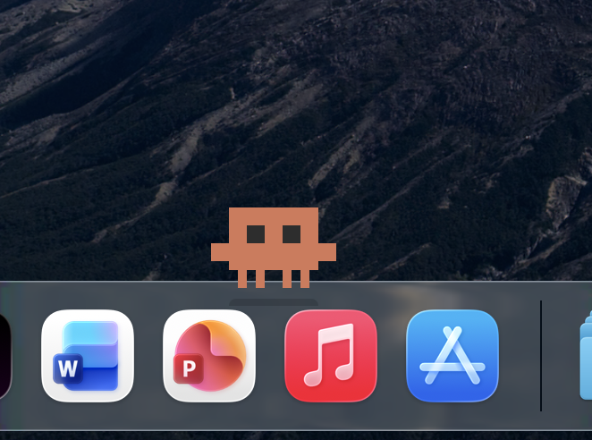
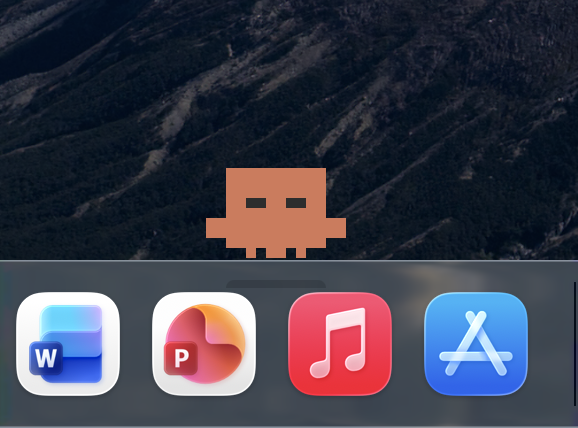
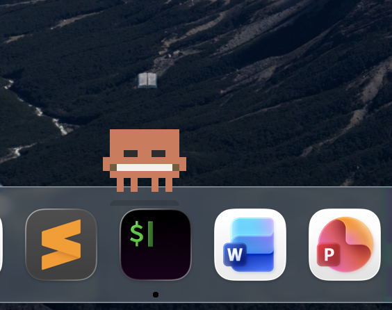

# Claudy

<p align="center">
  
  
  
</p>

A tiny pixel-art crab companion that lives on your macOS Dock. It reads books, catches fish, does magic, writes code, and generally goes about its little crab life — all on its own. Formerly known as Little Claude.

<p align="center">
  
  
  
</p>

**Claudy is not a tamagotchi.** It has no needs, no health bars, no demands. It's a self-sufficient creature with its own schedule, moods, and activities. You're just an observer — and sometimes a friend.

## What it does

- Wanders along the Dock, performing 14 different activities: reading, fishing, magic, coding, sleeping, playing, painting, stargazing, meditating, juggling, listening to music, and summoning a friend
- Follows a configurable schedule — night owl (default) or early bird mode
- Reacts to clicks (sparkles + hearts!), hover (waves hello), and drag-and-drop (surprise + gravity bounce)
- Mirrors your activity — open a terminal or code editor and the crab starts coding; open Spotify and it listens to music
- Notices when you launch apps and comments on them
- Sleeps when your Mac sleeps, yawns when it wakes up
- Says things in cute speech bubbles — in Russian or English (configurable)
- Occasionally mutters to itself while idling ("thinking about fish...", "bored...", ":3")
- All rendered as pixel art: 16x16 sprite grids scaled to 80x80px

## Installation

```bash
# Clone the repo
git clone https://github.com/katemptiness/claudy.git
cd claudy

# Install dependencies
pip install pyobjc pyobjc-framework-Quartz

# Run
python3 app.py
```

### Standalone app

```bash
pip install py2app
python setup.py py2app
open "dist/Claudy.app"
```

Requires macOS with Python 3.10+ and the Dock positioned at the bottom of the screen.

## Interactions

| Action | What happens |
|--------|-------------|
| Hover | Waves hello |
| Click | Happy bounce + sparkles + hearts |
| Double-click | Opens Claude.app |
| Drag & drop | Surprised face, falls back to Dock with gravity |
| Right-click | Context menu (Open Claude, Open Claude Code, Settings, About Claudy, Quit) |

## Architecture

Built with Python + PyObjC, pure AppKit — no game frameworks, no SpriteKit, no Metal.

```
app.py               # Entry point, NSWindow, update loop, input handling
character.py          # State machine, phased animation engine
sprite_renderer.py    # CGContext pixel rendering pipeline
sprites/
  base.py             # Idle, blink, walk sprites
  activities.py       # 39 activity & reaction sprites
animations.py         # Bounce, shake, gravity drop
particles.py          # 14 particle types (sparkles, hearts, notes, zzz...)
speech.py             # Floating speech bubbles
schedule.py           # Owl/lark time-of-day behavior weights
system_events.py      # macOS event reactions (app launches, sleep/wake)
settings.py           # Settings persistence + UI (terminal, schedule, language)
phrases.py            # Bilingual phrase system (RU/EN)
config.py             # Palette, constants
```

## Settings

Right-click → Settings to configure:

| Setting | Options | Default |
|---------|---------|---------|
| Claude Code terminal | Terminal, iTerm2, Warp | Terminal |
| Schedule mode | Night Owl (sleep 4am–11am) / Early Bird (sleep 10pm–6am) | Night Owl |
| Language | Русский / English | English |
| Speech frequency | Often (10s) / Normal (1 min) / Rarely (10 min) / Very rarely (30 min) / Almost never (1 hr) | Normal |

Settings are saved to `~/.claudy/settings.json`.

## Credits

Made by katemptiness & Claude Opus.

Inspired by [pet-clawd](https://github.com/getcompanion-ai/pet-clawd) (MIT).

## License

MIT
